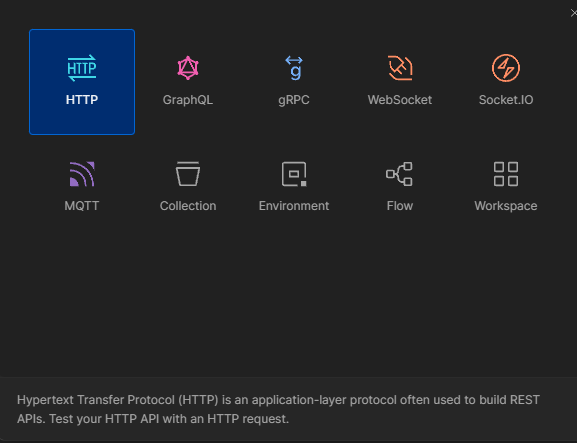
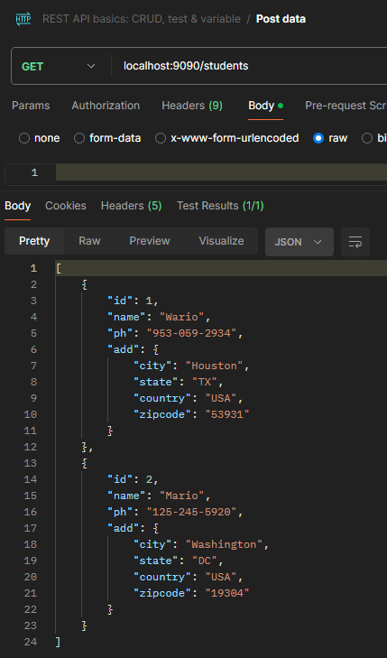

# RESTfulAPI
Create and test RESTful APIs using Spring Boot and Postman. Learners will develop two sets of APIs: one that interacts with a database using JPA and another that works without a database.
### Week 5 Assignment
### Building and Testing RESTful APIs with Spring Boot and Postman
### Thomas Birt
### April 21, 2024

## *How to setup and run your Java Application*

The default mySQL username and password would be 'root' and 'root’ with the server port set to **9090**.

Start up the MySQL Workbench client and create a new schema.

Name the schema database, ‘studentapi’

Go ahead and run the @SpringBootApplication.

The @SpringBootApplication will now add a new student table to the studentapi database with the columns (id, name, ph, city, country, state, zipcode)

In your Postman application, add a new HTTP request.

In our new request, send a GET request to localhost:9090/students to retrieve all students. For now, our table is empty.

Send a POST request to localhost:9090/students with a JSON body containing student details.

We can send another POST request with a JSON body containing different student details.

Send a GET request to localhost:9090/students/1 to retrieve student ID 1.

We will again send a GET request to localhost:9090/students to retrieve all students.

Let's send a PUT request to localhost:9090/students/2 with a JSON body containing updated student details of student ID 2.

Student ID 2 has now changed it's dataset to the Rock!

Let's now send a DELETE request to localhost:8080/students/2 to delete the Rock student.

Student ID 2 is now removed from our student table.

We can also run @SpringBootApplication on our Without DB application and do the same steps with Postman.
